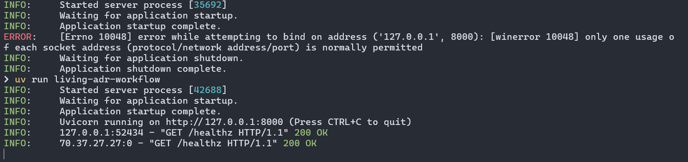
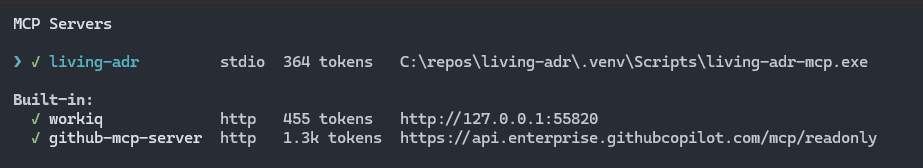
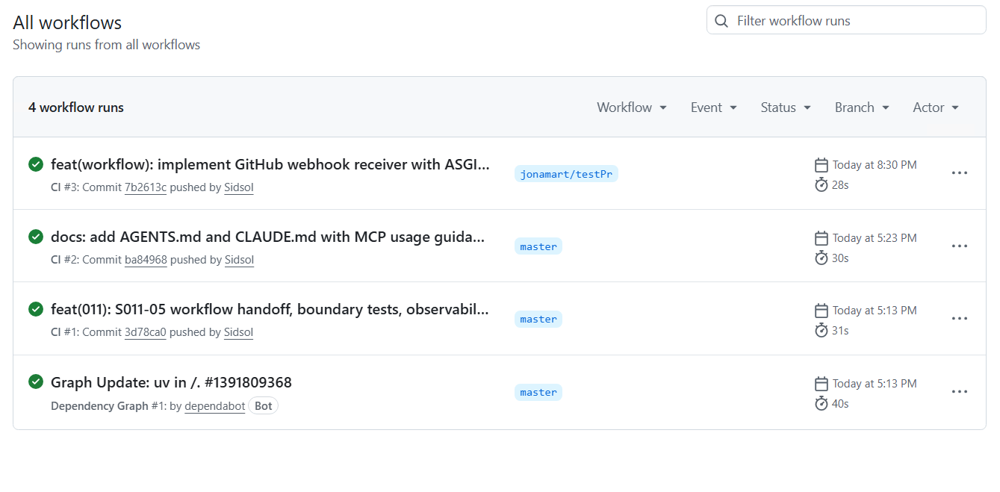

# living-adr

Single local repo containing shared core code plus two deployables:
`workflow-service` (receives GitHub webhooks) and `mcp-context-server` (serves
ADR context to LLM tools over MCP).

## Contents

- [Quick start](#quick-start)
- [Architecture](#architecture)
- [Configuration](#configuration)
- [Deployables](#deployables)
- [Running the webhook receiver](#running-the-webhook-receiver)
- [Exposing the receiver with a public tunnel](#exposing-the-receiver-with-a-public-tunnel)
- [GitHub App setup](#github-app-setup)
- [Verifying end to end](#verifying-end-to-end)
- [Repository onboarding validation](#repository-onboarding-validation)
- [Current capabilities and limitations](#current-capabilities-and-limitations)
- [Current capabilities in action](#current-capabilities-in-action)

## Architecture

```mermaid
flowchart LR
    gh["GitHub App<br/>(Sidsol/living-adr)"]
    tunnel["Public HTTPS tunnel<br/>(Dev Tunnels / ngrok)"]

    subgraph workflow["workflow-service · living-adr-workflow"]
        direction TB
        recv["POST /webhooks/github"]
        verify["Verify HMAC<br/>(GITHUB_WEBHOOK_SECRET)"]
        filter["Filter merged PRs<br/>+ dedupe by delivery id"]
        recv --> verify --> filter
    end

    subgraph provider["Provider path (planned, not yet wired)"]
        direction TB
        evidence["Evidence fetch"]
        draft["ADR draft<br/>(ANTHROPIC_API_KEY)"]
        review["Human review (HITL)"]
        publish["Publish ADR"]
        evidence --> draft --> review --> publish
    end

    store[("SQLite ingestion store<br/>ingestion.db")]
    config["living-adr.config.yaml<br/>+ .env / secrets"]

    mcp["mcp-context-server<br/>living-adr-mcp (stdio)"]
    llm["LLM tools / IDE agents"]

    gh -- "PR & ping/installation events" --> tunnel
    tunnel --> recv
    filter -- persist --> store
    filter -. "provider=None today" .-> evidence
    publish -. "writes ADRs" .-> gh

    config -. "read once at startup" .-> workflow
    config -. "read once at startup" .-> mcp

    store --> mcp
    mcp -- "ADR context over MCP" --> llm

    classDef planned stroke-dasharray:5 5,fill:#f6f6f6,stroke:#999,color:#333;
    class provider,evidence,draft,review,publish planned;
```



**Today** the running service does **receive → verify → filter → persist** (solid
path). The **provider path** (dashed) — evidence → ADR draft → human review →
publish — and the `mcp-context-server` are implemented in the codebase but the
provider chain is **not yet wired into the live `workflow-service`** (`provider`
is `None` at startup). See
[Current capabilities and limitations](#current-capabilities-and-limitations).

## Quick start

Prerequisites: [`uv`](https://docs.astral.sh/uv/) and Python `>=3.12,<3.13`.

```
uv sync          # install dependencies (also installs the console scripts)
uv run pytest    # run the test suite
```

Console scripts installed by `uv sync`:

| Script                 | Purpose                                                  |
|------------------------|----------------------------------------------------------|
| `living-adr`           | Operator CLI (repository onboarding validation).         |
| `living-adr-workflow`  | HTTP webhook receiver (the GitHub App delivers here).    |
| `living-adr-mcp`       | stdio MCP server that serves ADR context to LLM tools.   |

## Configuration

Configuration is split between a typed YAML config file and environment
variables. **Secrets always live in the environment (or a vault), never in the
YAML.** Configuration is read once at startup — after changing the YAML or any
environment variable you must **restart** the affected deployable. There is no
hot reload.

### 1. Environment variables

Copy the template and fill in real values:

```
cp .env.example .env
```

| Variable                       | Required for          | Notes                                                            |
|--------------------------------|-----------------------|------------------------------------------------------------------|
| `LIVING_ADR_CONFIG`            | all deployables       | Absolute path to your `living-adr.config.yaml`.                  |
| `GITHUB_WEBHOOK_SECRET`        | webhook receiver      | HMAC secret; must match the GitHub App's webhook **Secret**.    |
| `LIVING_ADR_STORAGE_PATH`      | webhook receiver      | Directory for the SQLite ingestion store.                        |
| `GITHUB_APP_ID`                | provider path         | Numeric GitHub App ID.                                            |
| `GITHUB_APP_PRIVATE_KEY_PATH`  | provider path         | Absolute path to the App's `.pem` private key (keep it secret).  |
| `ANTHROPIC_API_KEY`            | ADR drafting          | Consumed by later draft stages.                                  |
| `LANGSMITH_API_KEY`            | observability         | Optional; observability is a no-op when unset.                  |
| `LIVING_ADR_UI_TOKEN`          | review UI             | Bearer token guarding the local review UI.                       |
| `LIVING_ADR_HOST` *(optional)* | webhook receiver      | Bind host for `living-adr-workflow`. Default `127.0.0.1`.        |
| `LIVING_ADR_PORT` *(optional)* | webhook receiver      | Bind port for `living-adr-workflow`. Default `8000`.             |

Generate strong random secrets (e.g. `GITHUB_WEBHOOK_SECRET`,
`LIVING_ADR_UI_TOKEN`) however you prefer, for example:

```
python -c "import secrets, base64; print(base64.b64encode(secrets.token_bytes(32)).decode())"
```

> The webhook receiver only needs `LIVING_ADR_CONFIG`,
> `GITHUB_WEBHOOK_SECRET`, and `LIVING_ADR_STORAGE_PATH` to start. The GitHub App
> credentials and LLM keys are only required once the provider path (evidence →
> draft → review → publish) is wired in.

### 2. Repository config (`living-adr.config.yaml`)

Describes the repository the PoC tracks (canonical key `host/owner/repo`) and its
publication policy. It is gitignored. The `github_app_installation_id` field is
filled in after you install the GitHub App (see below).

## Deployables

| Deployable           | Run with               | Transport | Reads config |
|----------------------|------------------------|-----------|--------------|
| `workflow-service`   | `living-adr-workflow`  | HTTP      | yes          |
| `mcp-context-server` | `living-adr-mcp`       | stdio     | yes          |

## Running the webhook receiver

The deployables read configuration from **process environment variables**, not
from `.env` directly. Load `.env` into your shell, then start the receiver:

```
uv run living-adr-workflow
```

On Windows the helper script loads `.env` for you and starts the service:

```
pwsh -File scripts\run-workflow.ps1
```

It serves these routes:

- `GET  /healthz` → `{"status":"ok"}` (liveness probe)
- `POST /webhooks/github` → verifies the GitHub HMAC signature, filters for
  merged pull-request events, persists the delivery to the SQLite store at
  `${LIVING_ADR_STORAGE_PATH}/ingestion.db`, and (when the provider + drafting
  keys are configured) schedules ADR drafting off the request path.
- `GET  /hitl/reviews` and `GET /hitl/reviews/{thread_id}` → the token-guarded
  human review UI (send the `X-UI-Token: ${LIVING_ADR_UI_TOKEN}` header).

By default it binds `127.0.0.1:8000`. Override with `LIVING_ADR_HOST` /
`LIVING_ADR_PORT`. The process fails fast if `GITHUB_WEBHOOK_SECRET` is missing
or the config is invalid. Config + env are read once at startup — restart after
any change (there is no hot reload).

## Exposing the receiver with a public tunnel

GitHub cannot reach `127.0.0.1`, so for local development you need a public
HTTPS tunnel that forwards to the receiver's port. Any tunnel works; the webhook
URL is always the tunnel's public origin with **`/webhooks/github`** appended.

### Microsoft Dev Tunnels (recommended)

`devtunnel` is Microsoft-signed and works where other tunnels may be blocked by
Application Control / WDAC policies.

```
winget install Microsoft.devtunnel

devtunnel user login                       # sign in (add -d for device-code flow)
devtunnel create living-adr --allow-anonymous
devtunnel port create living-adr -p 8000 --protocol http
devtunnel host living-adr                  # keep this running
```

On Windows, after the one-time setup above, the helper script hosts the tunnel:

```
pwsh -File scripts\run-tunnel.ps1
```

The public URL has the form:

```
https://<tunnel-id>-<port>.<cluster>.devtunnels.ms
```

So the webhook URL to give GitHub is:

```
https://<tunnel-id>-8000.<cluster>.devtunnels.ms/webhooks/github
```

Confirm the live URL from the `devtunnel host` output (`Connect via browser`)
and set the GitHub App's **Webhook URL** to that origin + `/webhooks/github`.
Both the receiver (`scripts\run-workflow.ps1`) and the tunnel host
(`scripts\run-tunnel.ps1`) must stay running. For unattended/durable operation,
register both as Windows Scheduled Tasks (or a service via NSSM) so they restart
on logon/reboot.

### ngrok (alternative)

If your environment permits it:

```
ngrok config add-authtoken <token>
ngrok http 8000
```

Use the printed `https://<id>.ngrok.app/webhooks/github` as the webhook URL.

## GitHub App setup

1. Create a GitHub App (Settings → Developer settings → GitHub Apps → New).
2. **Permissions:** Contents — Read & write; Pull requests — Read & write;
   Metadata — Read-only.
3. **Subscribe to events:** Pull request.
4. **Webhook URL:** your public tunnel URL + `/webhooks/github`.
5. **Webhook secret:** the same value as `GITHUB_WEBHOOK_SECRET` in `.env`.
6. Save. Note the **App ID** → set `GITHUB_APP_ID` in `.env`.
7. **Generate a private key** → download the `.pem` → store it at
   `GITHUB_APP_PRIVATE_KEY_PATH` (keep this directory out of git).
8. **Install** the App on the target repository. After installing, the URL is
   `https://github.com/settings/installations/<INSTALLATION_ID>` — copy that
   number into `github_app_installation_id` in `living-adr.config.yaml`.

When the webhook is saved GitHub immediately sends a `ping` delivery, and a
`installation` delivery is sent when you install the App; both are verified and
recorded as `skipped` (non-pull-request events).

## Verifying end to end

With the receiver and tunnel running:

```
# Local liveness
curl http://127.0.0.1:8000/healthz

# Public liveness (through the tunnel)
curl https://<tunnel-id>-8000.<cluster>.devtunnels.ms/healthz
```

A genuine GitHub delivery (e.g. the `ping`) appears in the receiver log as a
`POST /webhooks/github 200`. Inspect what was persisted:

```
uv run python - <<'PY'
import sqlite3, os
db = os.path.join(os.environ["LIVING_ADR_STORAGE_PATH"], "ingestion.db")
con = sqlite3.connect(db)
for row in con.execute(
    "SELECT delivery_id, status, error_category, detail "
    "FROM ingestion_deliveries ORDER BY received_at DESC LIMIT 10"):
    print(row)
con.close()
PY
```

Expected response codes from `POST /webhooks/github`:

| Code | Meaning                                                        |
|------|---------------------------------------------------------------|
| 200  | Verified but skipped (e.g. ping, non-merged PR) or duplicate. |
| 202  | Verified and accepted (merged pull request).                  |
| 401  | Invalid or missing HMAC signature.                            |
| 400  | Missing required headers.                                     |
| 422  | Malformed payload.                                            |

## Repository onboarding validation

Before expecting webhook ingestion to work, validate that the configured PoC
repository is ready:

```
uv run living-adr onboard validate --config path/to/living-adr.config.yaml
```

The check loads config through the typed config loader, verifies required
environment variables (see `.env.example` — copy it to `.env` and fill in real
values), and verifies the GitHub App installation and publication-policy
permissions for the configured repository. It prints grouped, secret-safe
diagnostics and exits non-zero when any blocking problem is found; a passing run
prints safe repository metadata and the next operational step.

This is **PoC single-repo onboarding validation** — it performs no multi-repo
governance automation, repository discovery, or hot reload. Configuration is read
at startup, so after changing config or environment values you must restart both
`living-adr-workflow` and `living-adr-mcp`.

## Current capabilities and limitations

The full living-ADR loop runs end to end against real GitHub + Claude:

1. ✅ **Receive → verify → filter → persist.** A merged-PR webhook is HMAC-verified
   against `GITHUB_WEBHOOK_SECRET`, filtered to merged pull requests, deduplicated
   by delivery id, and persisted to the SQLite ingestion store.
2. ✅ **Evidence.** The wired GitHub App provider (`GITHUB_APP_ID` + installation id
   + `.pem`) fetches the PR metadata, changed files, and diff (handle/summary only —
   no raw diff is stored).
3. ✅ **Classify → draft.** The real schema/API + dependency classifiers decide
   ADR-eligibility; an ADR draft is generated by **Claude** (`ANTHROPIC_API_KEY`).
   Drafting runs **off the webhook request** (FastAPI background task), so the
   webhook stays fast.
4. ✅ **Human review.** The draft pauses at a durable HITL checkpoint and is
   reviewed in the token-guarded UI at `/hitl/reviews/{thread_id}`.
5. ✅ **Approve → graph write.** Approving mints a one-shot `ApprovedReviewDecision`
   and performs the approval-bound write of the ADR into the local property graph.
6. ✅ **Publish.** The approved ADR is committed to a fresh branch and opened as a
   **pull request** into the configured `adr_target_branch` (`adr_publication_policy`
   must be a `publish_to_github*` policy; uses the App's write permissions).
7. ✅ **Serve context.** The read-only `mcp-context-server` serves the approved ADRs
   (`list_adrs` / `fetch_adr` / `answer_why`, with citations) from the **same**
   property-graph root (`LIVING_ADR_STORAGE_PATH/graph`).

PoC limitations:

- **Single repository.** No multi-repo governance, discovery, or fan-out.
- **No hot reload.** Config + `.env` are read once at startup; restart after edits.
- **Hosting is scripted, not supervised.** Use the `scripts/` helpers; add a
  Scheduled Task / NSSM service for auto-restart on reboot.
- **Approve-after-edit** records the decision but does not yet re-inject the edited
  Markdown into the published record (plain approve publishes the reviewed draft).
- **Publication is gated by the completed approval** (which consumed the one-shot
  capability for the graph write) rather than a second independent capability.
- LangGraph emits msgpack "unregistered type" *deprecation warnings* on checkpoint
  reload (harmless today).

## Current capabilities in action

The screenshots below show the working pieces of the PoC today.

### Webhook receiver accepting deliveries

The `living-adr-workflow` service running locally on `127.0.0.1:8000`, answering
`GET /healthz` with `200 OK` for both a local request and a request relayed
through the public Dev Tunnel (`70.37.27.27`).



### MCP context server registered

The `living-adr` stdio MCP server (`living-adr-mcp`) registered and connected
alongside the built-in MCP servers.



### Automated CI workflows

GitHub Actions CI runs passing on pushed commits and pull requests.


